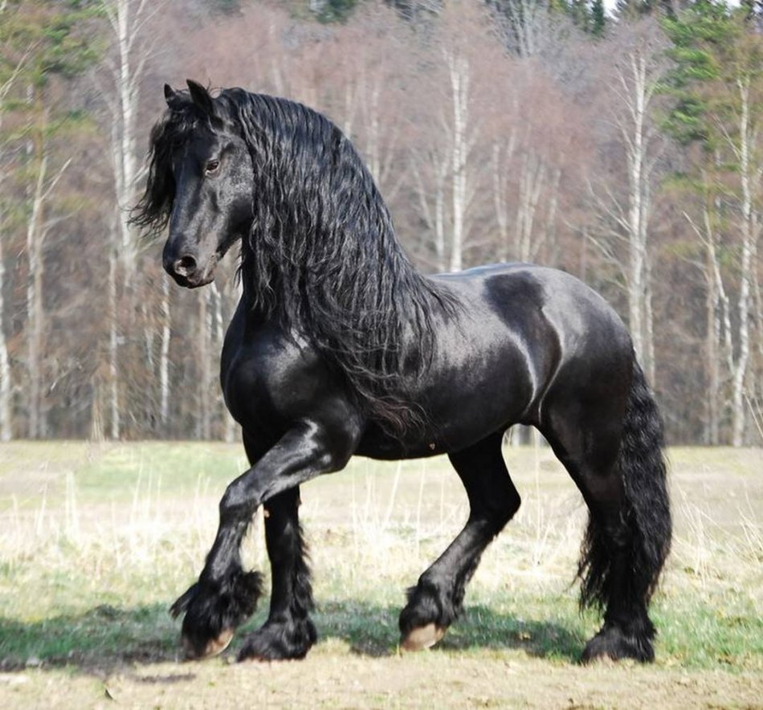

# my_pro
# my_project (pervogo urovnya)
## second title (zagolovok vtorogo urovnya)

**zhirniy text**

_italics_

**_zhirniy italics_**

~zacherkivat~
* Navalny’s team said on Thursday that the water bottle removed from his hotel room in the city of Tomsk last month had been taken to Germany and found to have traces of Novichok nerve agent.
    * LJEFVPKJEOPFV (chetyre probela i zwezda s probelom)
        * SJEFHIVJHPEIFJVEOGF
* Asked about the finding, Kremlin spokesman Dmitry Peskov said that Russian specialists had been unable to examine the bottle and that Moscow was therefore not able to comment.
* We cannot explain this because, as you know, this bottle -- if it did exist -- was taken away to Germany or somewhere else. So, something that could have become evidence of a poisoning was unfortunately taken out. This (raises) an additional question: why?” said Peskov.

1. one
2. two
3. three

 

ne mado stavit tochki v skobkah, oni sami poyavlyajutsa

[lovely_horses](https://www.google.com/search?q=%D0%B0%D1%80%D0%B0%D0%B1%D1%81%D0%BA%D0%B8%D0%B9+%D0%BA%D0%BE%D0%BD%D1%8C&safe=strict&source=lnms&tbm=isch&sa=X&ved=2ahUKEwicvoqkuLvsAhXus4sKHbBhAR0Q_AUoAXoECAQQAw&biw=1366&bih=625#imgrc=OcODC24_3xEK5M)

https://www.google.com/search?q=%D0%B0%D1%80%D0%B0%D0%B1%D1%81%D0%BA%D0%B8%D0%B9+%D0%BA%D0%BE%D0%BD%D1%8C&safe=strict&source=lnms&tbm=isch&sa=X&ved=2ahUKEwicvoqkuLvsAhXus4sKHbBhAR0Q_AUoAXoECAQQAw&biw=1366&bih=625#imgrc=OcODC24_3xEK5M

column1 | column2 | column3
:------- | ---------: | :--------:
text1 | text2 | text3
text4 | text5 | text6

: - po pravomy, po levomu krayu ili poseredine
